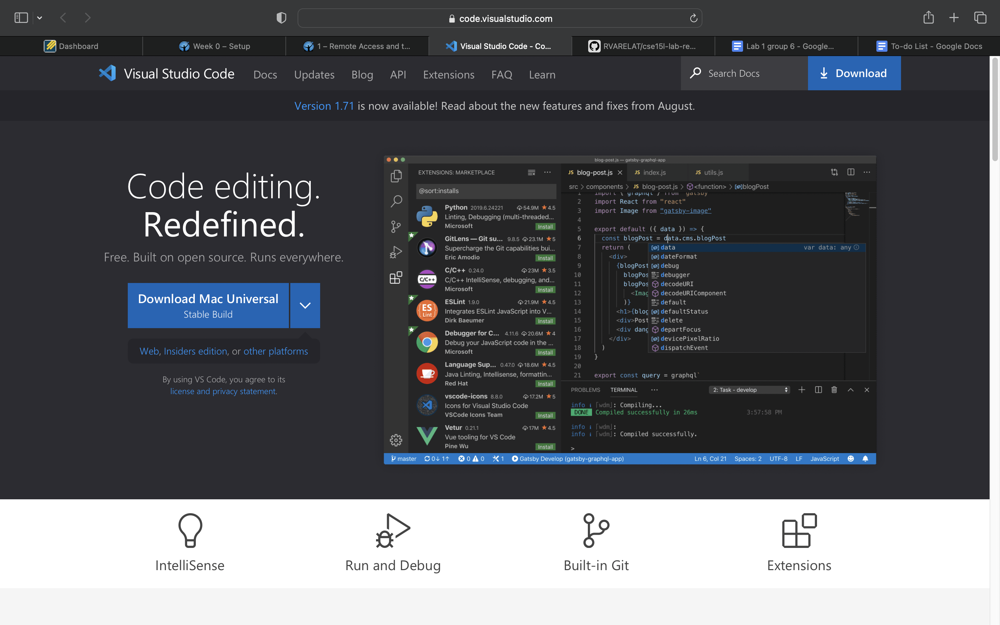
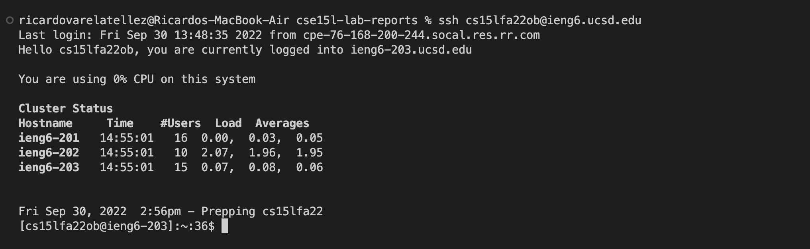
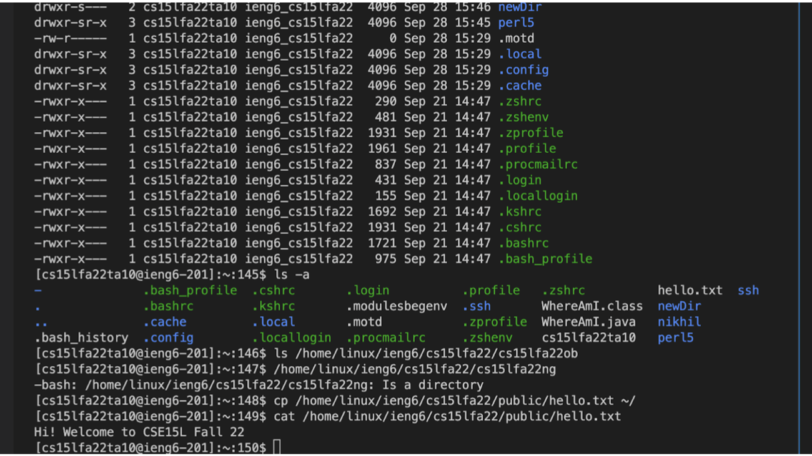
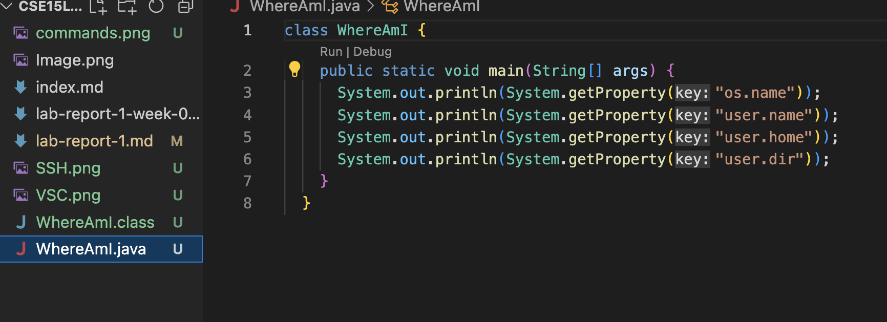
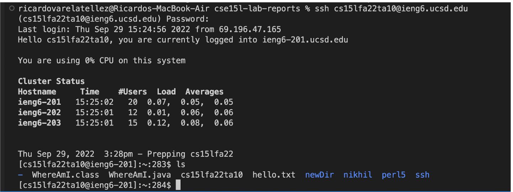
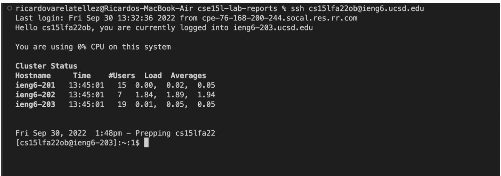
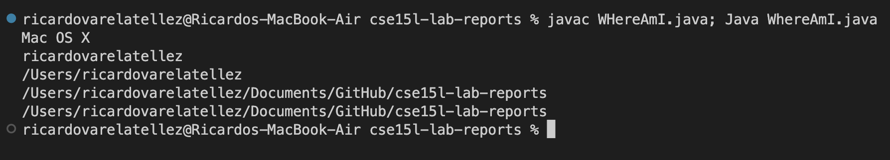

# Installing VScode: 
- Step 1: Install VS Code by going to this site https://code.visualstudio.com/. 
- Step 2: Follow the Instructions on the site. 
(I already had it downloaded so this step was easy)

# Remotely Connecting:
- Step 1: On the visual studio code terminal, type "ssh" follwed by your account username and "@ieng6.ucsd.edu".
- Step 2: If prompted for password, enter it by using copy-paste of password (Mine is set up to log in automatically without password)\

# Trying Some Commands:
- Step 1: In order to try some commands, make sure you are in the terminal
- Step 2: after ssh-ing, you can try some commands in on your computer or remote computer (below are some examples of commands I used including cat, cp, and ls commands.

# Moving Files with scp:
- Step 1: Create a file and make sure to compile and run your file in Visual Studio Code. 

- Step 2: Now in your terminal from the directory you made your file run "scp filename.java cs15lfa22zz@ieng6.ucsd.edu:~/". "scp" or secure copy copies files from one computer to another.
- Step 3: reenter your password when you just like when you enter with ssh,
- step 4: log in to ieng6 with ssh, use "ls" to list the files in your home directory. Now you can run and compile thise file in your ieng6 computer

# Setting an SSH Key
- Step 1: from your local computer, simply type ssh-keygen into your terminal. From here you want to enter the file in which to save key. (mine is a bit different since I have already done this so I overwrote my key, the same idea is applied though). From here you want to continously press enter until all the info shows up.

- Step 2: copy the public key to the .ssh directory of your account on the server. Log into ssh cs15lfa22xx and input your password.
- Step 3: now in your client type "scp /Users/username/.ssh/id_rsa.pub cs15lfa22@ieng6xx.ucsd.edu:~/.ssh/authorized_keys" and you will input your password.
- step 4: what we did here is we no longer need to type password when trying to ssh or scp on this client to server. So try this by loggin in with ssh.

# Optimizing Remote Running
- Step 1: One example is, if we want to make an edit to a file I would have to make an edit to WhereAmI.java
- Step 2: Then I will compile and run this file.
- Step 3: Next I would use scp in my terminal. From there just use copy-paste and use the arrow key on the non-client terminal. 
(In example below I compiled and ran a file in the same line after making changes to file)

