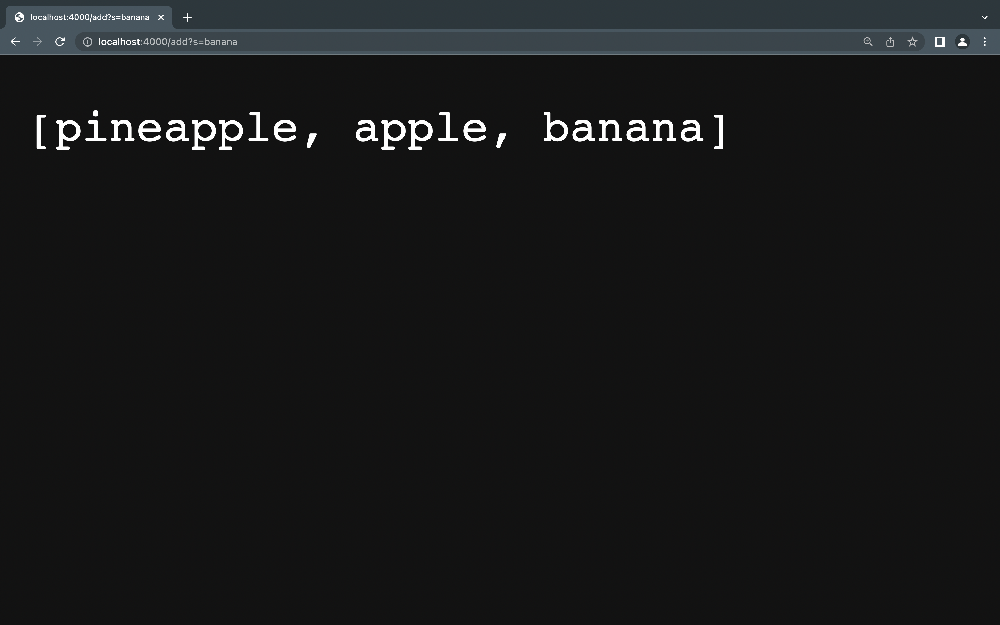
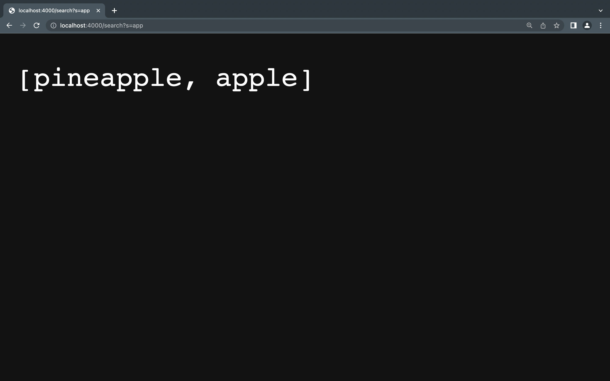
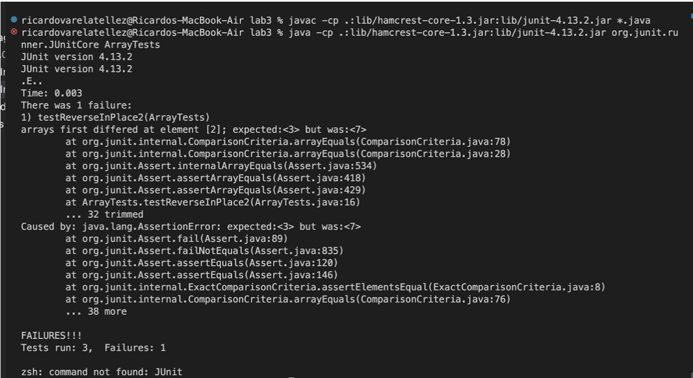
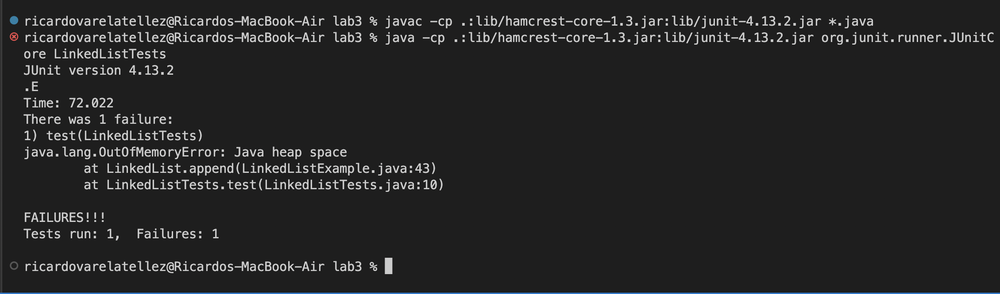

# Part 1 (Simplest Search Engine)

# Full Code
``` import java.io.IOException;
import java.net.URI;
import java.util.ArrayList;

class Handler implements URLHandler {
    // The one bit of state on the server: a number that will be manipulated by
    // various requests.
    ArrayList<String> list = new ArrayList<>();

    public String handleRequest(URI url) {
        if (url.getPath().equals("/")) {
            return list.toString();
        } 
        else {
            System.out.println("Path: " + url.getPath());
            if (url.getPath().contains("/add")) {
                String[] parameters = url.getQuery().split("=");
                if (parameters[0].equals("s")) {
                    list.add(parameters[1]);
                    return list.toString();
                }
            }
            if (url.getPath().contains("/search")) {
                String[] parameters = url.getQuery().split("=");
                if (parameters[0].equals("s")) {
                    ArrayList<String> newList = new ArrayList<>();
                    for (String s: list) {
                        if (s.contains(parameters[1])) {
                            newList.add(s);
                        }
                    }
                    return newList.toString();
                }
            }
            return "404 Not Found!";
        }
    }
}

class SearchEngine{
    public static void main(String[] args) throws IOException {
        if(args.length == 0){
            System.out.println("Missing port number! Try any number between 1024 to 49151");
            return;
        }

        int port = Integer.parseInt(args[0]);

        Server.start(port, new Handler());
    }
} 
```


# Methods Called


- When we compile Server.java and SearchEngine.java and run SearchEngine with a port number we are given a link in the terminal
- We copy this link and paste it to our URL Browser
- In this screenshot, our ArrayList is empty as our first if statement is triggered as our path equals "/". Therefore, our empty ArrayList as a string is returned.
``` 
if (url.getPath().equals("/")) {
            return list.toString();
        } 
```

# Relevant arguments and fields of the class

``` 
System.out.println("Path: " + url.getPath());
if (url.getPath().contains("/add")) {
    String[] parameters = url.getQuery().split("=");
    if (parameters[0].equals("s")) {
```
- When we print our URL path, our relevant arguments include "=" and "s" as they are provided in every URL path we use when using "add" or "search". 
- Therefore, our relevants fields of our class are the path containing "/" , "/add" or "/search" as this will trigger the if statement and execute what our program should display. For, "/" it should display an empty list, for "add" it should display our list with our added strings such as "pineapple, apple, banana" and our "/search" path should display a list with the strings that include the given substring. 
(an example within our code of our relevant arguments are shown above)

# Values Change
## /add

- In this example, when we use our /add path using the words "pineapple, apple, and banana" these strings our added to our ArrayList as expected. This is shown in the Sscreenshot above. 
- Our code below is what is triggering this behavior. (We add "paramters[1]" in our list every time as that is our string in our "/add" path)
``` 
if (url.getPath().contains("/add")) {
    String[] parameters = url.getQuery().split("=");
    if (parameters[0].equals("s")) {
        list.add(parameters[1]);
        return list.toString();
    }
}
``` 

## /search

- In this example, when we use our /search path, we expect to search our list for the strings with the given substring. In our screenshot, the substring is "app" and therefore, we search through our list and expect a new list with our strings "pineapple, apple" to be returned as those words conatiain the "app" substring.
- In our code below, we create a new arraylist as that is where we want our Strings to be added with the given substring. We use a for loop to iterate through our list with our strings, and add this string to our new list if it contains "parameters[1]" which stands for the substring in this case. We return this new list once our for loop finishes. 
``` 
if (url.getPath().contains("/search")) {
    String[] parameters = url.getQuery().split("=");
    if (parameters[0].equals("s")) {
        ArrayList<String> newList = new ArrayList<>();
        for (String s: list) {
            if (s.contains(parameters[1])) {
                newList.add(s);
            }
        }
        return newList.toString();
    }
}
``` 


# Part 2
# reverseInPlace (ArrayExamples.java)

## Failure Inducing input
- The reverseInPlace Method is not reversing the list but instead it is "Mirroring" itself. That is why the first number is still 3 after calling the method on the "input 1" list.
```
@Test 
	public void testReverseInPlace2() {
    int[] input1 = { 3, 5, 7 };
    ArrayExamples.reverseInPlace(input1);
    assertArrayEquals(new int[]{ 7, 5, 3 }, input1);
	}
```

## The Symptom
- Our output in our terminal shows us that "expected<3> but was <7>" as we expect this error to happen because of the "mirroring" effect.


## The Bug
- The method before was just mirroring the list instead of reversing the order. 
Changes: (I created a temp array to avoid the mirroring effect)
```
for(int i = 0; i < arr.length; i += 1) {
    arr[i] = temp[arr.length -i -1];
}
```

## Connection of symptom and bug 
- The bug causes to list [3, 5, 7] to be reversed in place as this part in the code:
``` 
arr[i] = arr[arr.length -i -1]
```
- It was making the number 3 copy itself to the beginning and end of the list and not reversing anything. Therefore, our symptom would be the list [3, 5, 3] which is what us shown in our terminal. 


# Linked List Method append (LinkedListExample.java)

## Failure inducing input
- We are running into an infinite loop error as it seems that our test is not even showing us what the error is as it is constantly loading. I am using a test with two numbers and appending a number to make sure my first number is not being changed.
```
import static org.junit.Assert.*;
import org.junit.*;

public class LinkedListTests {
    @Test 
	public void test() {
        LinkedList testList = new LinkedList();
        testList.prepend(14);
        testList.prepend(15);
        testList.append(17);
        assertEquals("list should be 15, 14, 17", 15, testList.first());

	}
}
```

## The Symptom
- The error seems to be "java heap space" which we can interpret this is being cause by an infinite loop in a Linked list Method.


## The Bug
- The bug seems to be found in our append method. When we enter our while loop we want to make sure we are moving on to the next node. Therefore, our while loop is currently running on the same node which is causing the infinite loop error. (I moved the line of code that is suppose to move to the next node outside the while loop to make sure we don't constantly run the while loop on the same node)
```
/**
     * Adds the value to the _end_ of the list
     * @param value
     */
    public void append(int value) {
        if(this.root == null) {
            this.root = new Node(value, null);
            return;
        }
        // If it's just one element, add if after that one
        Node n = this.root;
        if(n.next == null) {
            n.next = new Node(value, null);
            return;
        }
        // Otherwise, loop until the end and add at the end with a null
        while(n.next != null) {
            n = n.next;
            n.next = new Node(value, null);
        }
    }
```

## Connection of symptom and bug
- The bug causes our symptom for my input of a linkedList with the values of "15, 14, 17" as when I called the append method, this causes the infinite loop. Therefore, our symptom is what our terminal told us which is "java heap space". Therefore, for this append method the input would not really matter as the bug is with the method and not the input that it's given. 
``` 
//Otherwise, loop until the end and add at the end with a null
    while(n.next != null) {
        n = n.next;
        //n.next = new Node(value, null);
    }
    n.next = new Node(value, null);
```