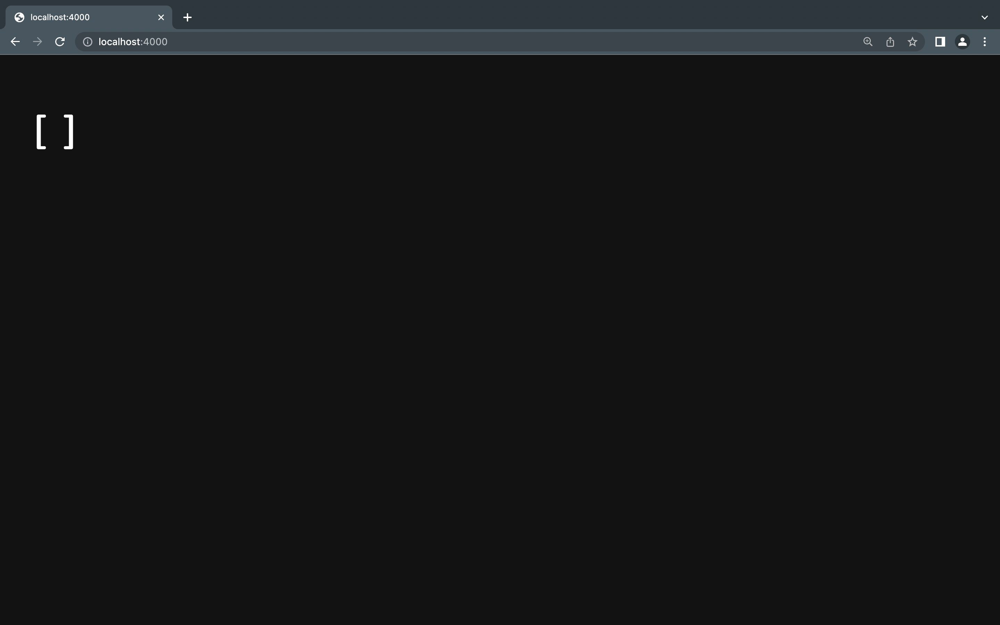

# Part 1 (Simplest Search Engine)

# Full Code
``` import java.io.IOException;
import java.net.URI;
import java.util.ArrayList;

class Handler implements URLHandler {
    // The one bit of state on the server: a number that will be manipulated by
    // various requests.
    ArrayList<String> list = new ArrayList<>();

    public String handleRequest(URI url) {
        if (url.getPath().equals("/")) {
            return list.toString();
        } 
        else {
            System.out.println("Path: " + url.getPath());
            if (url.getPath().contains("/add")) {
                String[] parameters = url.getQuery().split("=");
                if (parameters[0].equals("s")) {
                    list.add(parameters[1]);
                    return list.toString();
                }
            }
            if (url.getPath().contains("/search")) {
                String[] parameters = url.getQuery().split("=");
                if (parameters[0].equals("s")) {
                    ArrayList<String> newList = new ArrayList<>();
                    for (String s: list) {
                        if (s.contains(parameters[1])) {
                            newList.add(s);
                        }
                    }
                    return newList.toString();
                }
            }
            return "404 Not Found!";
        }
    }
}

class SearchEngine{
    public static void main(String[] args) throws IOException {
        if(args.length == 0){
            System.out.println("Missing port number! Try any number between 1024 to 49151");
            return;
        }

        int port = Integer.parseInt(args[0]);

        Server.start(port, new Handler());
    }
} 
```


# Methods Called


- When we compile Server.java and SearchEngine.java and run SearchEngine with a port number we are given a link in the terminal
- We copy this link and paste it to our URL Browser
- In this screenshot, our ArrayList is empty as our first if statement is triggered as our path equals "/". Therefore, our empty ArrayList as a string is returned.
``` 
if (url.getPath().equals("/")) {
            return list.toString();
        } 
```

# Relevant arguments and fields of the class

``` 
System.out.println("Path: " + url.getPath());
if (url.getPath().contains("/add")) {
    String[] parameters = url.getQuery().split("=");
    if (parameters[0].equals("s")) {
```
- When we print our URL path, our relevant arguments include "=" and "s" as they are provided in every URL path we use when using "add" or "search". 
- Therefore, our relevants fields of our class are the path containing "/" , "/add" or "/search" as this will trigger the if statement and execute what our program should display. For, "/" it should display an empty list, for "add" it should display our list with our added strings such as "pineapple, apple, banana" and our "/search" path should display a list with the strings that include the given substring. 
(an example within our code of our relevant arguments are shown above)

# Values Change
## /add

- In this example, when we use our /add path using the words "pineapple, apple, and banana" these strings our added to our ArrayList as expected. This is shown in the Sscreenshot above. 
- Our code below is what is triggering this behavior. (We add "paramters[1]" in our list every time as that is our string in our "/add" path)
``` 
if (url.getPath().contains("/add")) {
    String[] parameters = url.getQuery().split("=");
    if (parameters[0].equals("s")) {
        list.add(parameters[1]);
        return list.toString();
    }
}
``` 

## /search

- In this example, when we use our /search path, we expect to search our list for the strings with the given substring. In our screenshot, the substring is "app" and therefore, we search through our list and expect a new list with our strings "pineapple, apple" to be returned as those words conatiain the "app" substring.
- In our code below, we create a new arraylist as that is where we want our Strings to be added with the given substring. We use a for loop to iterate through our list with our strings, and add this string to our new list if it contains "parameters[1]" which stands for the substring in this case. We return this new list once our for loop finishes. 
``` 
if (url.getPath().contains("/search")) {
    String[] parameters = url.getQuery().split("=");
    if (parameters[0].equals("s")) {
        ArrayList<String> newList = new ArrayList<>();
        for (String s: list) {
            if (s.contains(parameters[1])) {
                newList.add(s);
            }
        }
        return newList.toString();
    }
}
``` 


# Part 2
