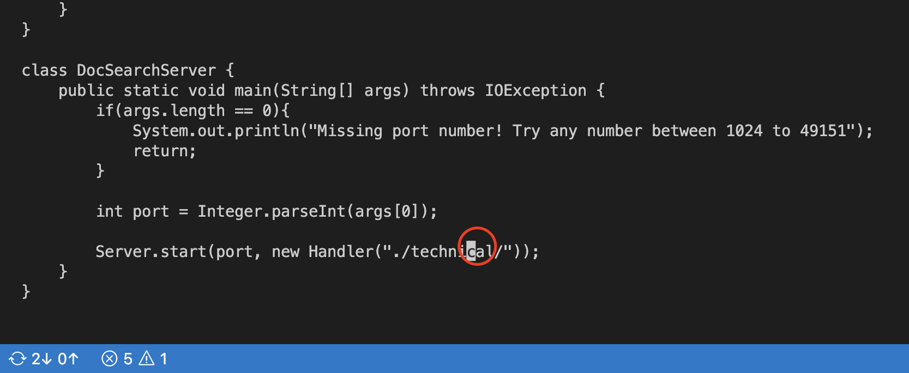

# Week 7 Lab Report

# Part 1: Changing the main method to take a command-line-argument

```
/cal<enter>n5ldibiargs[1]<esc>:wq<Enter>
```
- 24 Keys Pressed in Total

# Description of keys pressed
```
/cal<enter>n
```
- We search for the occurences of the query "cal" in our code and press enter, we will notice that we are not in the place we want to be when we first press enter, therefore, we press "n" to move on to the next occurence of the query "cal" which is where we want to be.
```
/cal
```

```
<enter>
```

```
n
```


```
5ldib
```
- Once we are in our desired spot, we use "5" and "l" to essentially move our cursor 5 times to the right, then we use "dib" which deletes what's inside our surrounded parantheses. I learned what dib is after researching online and it means, "It will delete the inner (...) block where the cursor is."
```
5l
```

```
dib
```


```
iargs[1]<esc>
```
- For this part, we enter insert mode with "i", then we type in "args[1]", and use "esc" to exit insert mode and go back to normal mode. This is the most important part as this is where we are actually making the change of changing the main method to take a command-line argument

```
i
```

```
args[1]<esc>
```


```
:wq<Enter>
```
- Finally, we want to save our changes using ":w" to save and "q" to quit. Make sure to press "Enter".


# Part 2:

- First style: This style took me about 50 seconds, I am a very slow typer, but I found this style to be more difficult since I honestly forgot how to SCP which can be a major issue since that would just ruin the whole point of this style.

- Second style: This style took me about 35 seconds, and I found it way more efficient, I did not really have any difficulties and I will say it did make me feel like making constant changes and testing will be smoother since we can make changes and run the tests on the same remote server.

## First Question:
- I would choose the second style if I had to work on a program that I was running remotely as it is more efficient since I am making the changes already in SSH. Therefore, I don't need to remember to do SCP when making the changes locally. The second style simply requires me to use VIM remotely to make the changes and from that same SSH session, I can run the tests on the changes I made.
## Second Question
- The only way a project or task may factor into my decision is if I don't have to copy my changes to the remote server. In that case, I don't see a reason to work on the remote server. Besides that, I feel like using VIM to make changes directly on the remote server is more efficient for me since I can easily run tests and make changes without worrying to do SCP.