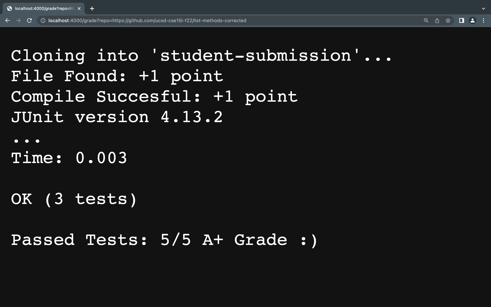
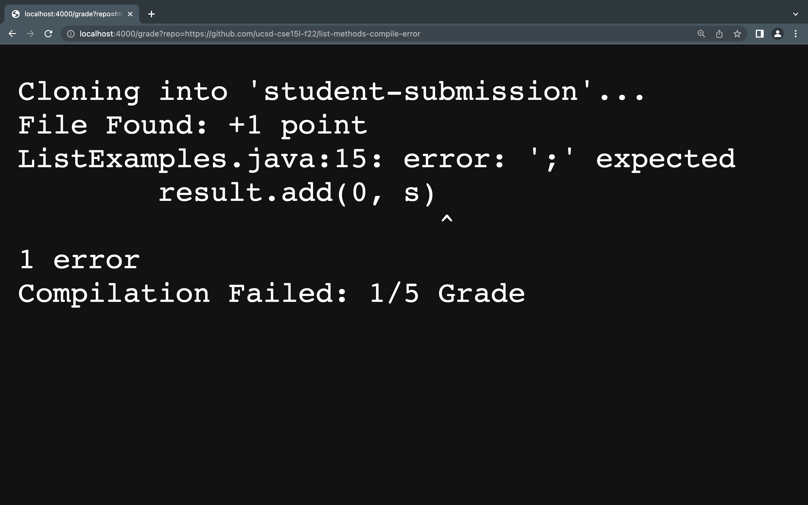
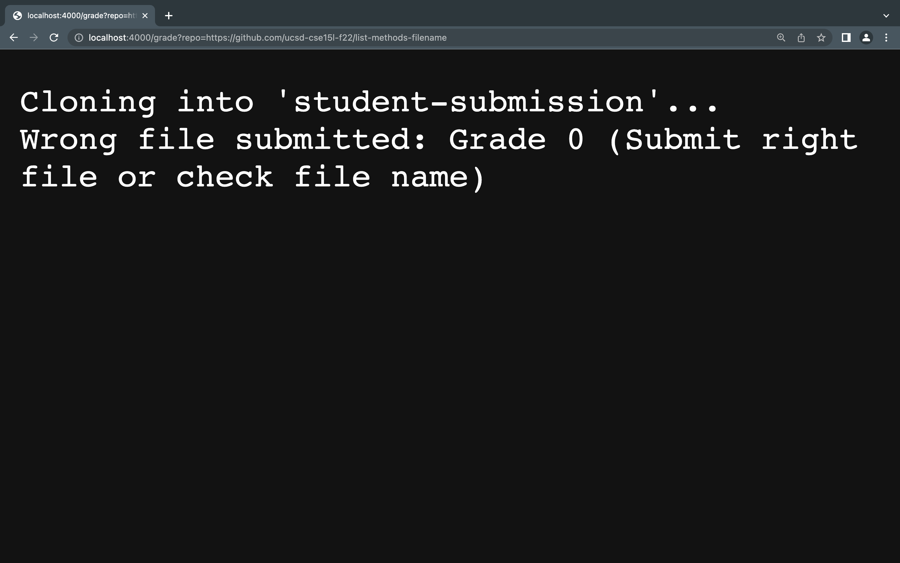

# Week 9 Lab Report

```
CPATH=".:../lib/hamcrest-core-1.3.jar:../lib/junit-4.13.2.jar"

rm -rf student-submission

# make student submission directory (credit to lab group partner Jan Kwong who had this great idea of creating a student submission directory to work with)
mkdir student-submission

git clone $1 student-submission

cp TestListExamples.java student-submission
cd student-submission


# space before [[ ]] to avoid error
if [[ -f "ListExamples.java" ]]
    then 
        echo "File Found: +1 point"
    else
        echo "Wrong file submitted: Grade 0 (Submit right file or check file name)"
        exit 0
fi 

javac -cp $CPATH *.java


if [[ $? -eq 0 ]]
    then 
        echo "Compile Succesful: +1 point"
    else 
        echo "Compilation Failed: 1/5 Grade" 
        exit 0
fi 

#credit to lab partner Jan Kwong who I borrowed the idea of using $CPATH to make sure we dont get the error of "error: package org.junit does not exist")
java -cp $CPATH org.junit.runner.JUnitCore TestListExamples > file2.txt

if [[ $? -eq 0 ]]
    then
        cat file2.txt
        echo "Passed Tests: 5/5 A+ Grade :)"
        exit
    else 
        cat file2.txt
        echo "Tests have failed: 2/5 Grade"
        exit
fi
```

## Screenshot for the output of which has the methods correct

- This student submission recieves full credit :).

## Screenshot for the output which has which has a syntax error of a missing semicolon

- This student submission gets credit for submitting the right file but since they failed the compilation, I only give them one point :(.

## Screenshot for the output which has a great implementation saved in a file with the wrong name.

- This student submission recieves no credit but I do make sure to leave a message saying to make sure they submit the right file/file name.

## Trace of grade.sh on the student submission which has a great implementation saved in a file with the wrong name.

 - When I run this in the terminal:
 ```
 bash grade.sh https://github.com/ucsd-cse15l-f22/list-methods-filename
 ```
 - The first thing that happens is a variable is created with the name CPATH that stores the library needed to run Junit
 ```
 CPATH=".:../lib/hamcrest-core-1.3.jar:../lib/junit-4.13.2.jar"
 ```
 - Then the line below clears the student-submission
 ```
 rm -rf student-submission
```
- After this i create a new directory for my student submission and use git clone to save this student-submission in this directory. "$1" uses our first parameter which is the link to clone this repostory.
```
mkdir student-submission
git clone $1 student-submission
```
- Next we want to make sure we cp and cd into the correct directory we want to work with. 
```
cp TestListExamples.java student-submission
cd student-submission
```

- Now this is where our student-submission comes into play, since this student-submission does not contain the right file, our if statement will be false because the file "ListExamples.java" is not found as this student named their file incorrectly. Therefore, the else statement is executed which echo's our message and exit 0 terminates the program as we now know that the student gets a grade 0 for submitting the wrong file name.
```
if [[ -f "ListExamples.java" ]]
    then 
        echo "File Found: +1 point"
    else
        echo "Wrong file submitted: Grade 0 (Submit right file or check file name)"
        exit 0
fi 
```

## Standard error and output, return code

## rm
- standard output: (empty)
- standard error: (empty)
- return code: 0

## mkdir 
- standard output: (empty)
- standard error: (empty)
- return code: 0

## git 
- standard output: (empty)
- standard error: Cloning into 'student-submission'...
- return code: 0

## cp 
- standard output: empty
- standard error: empty
- return code: 0

## cd
- standard output: empty
- standard error: empty
- return code: 0

## echo
- standard output: Wrong file submitted: Grade 0 (Submit right file or check file name)
- standard error: empty
- return code: 0
